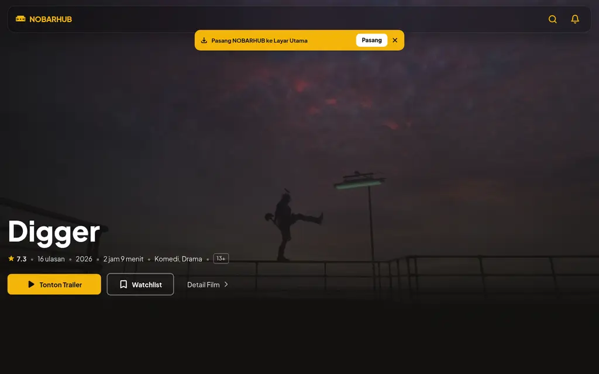
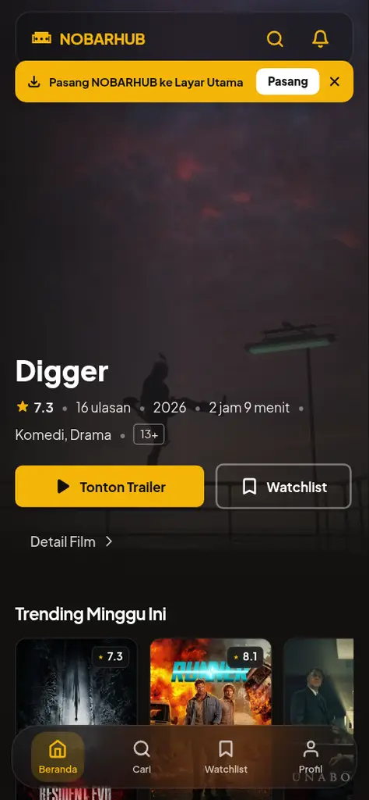
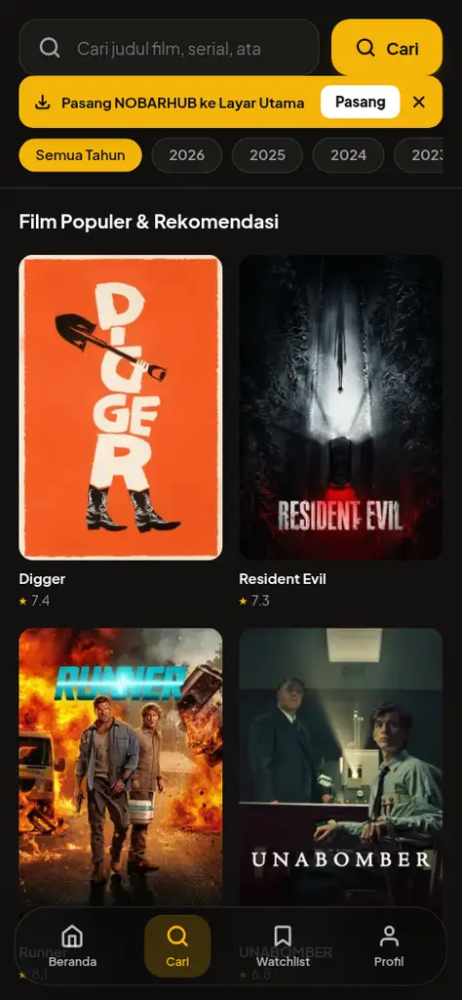
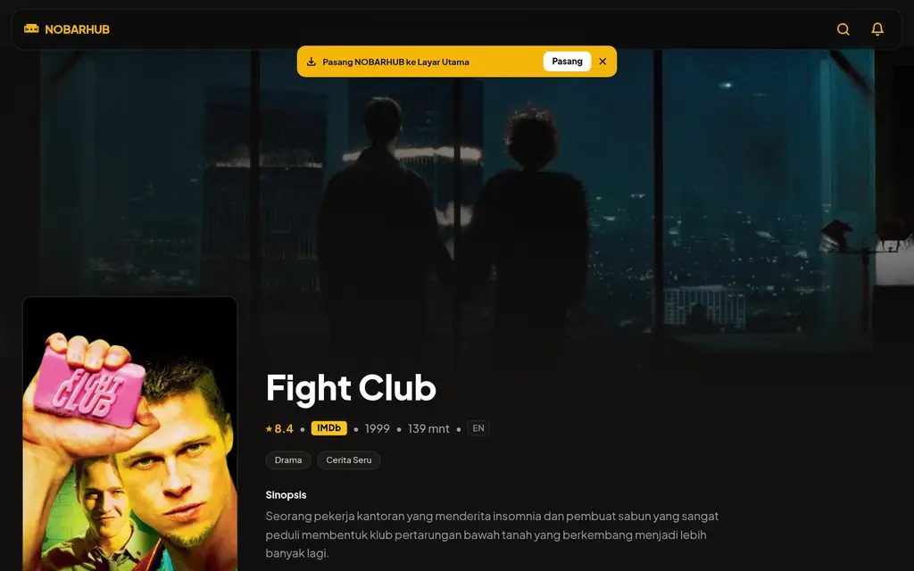

# 🎬 NobarHub — Katalog Sinema & Rekomendasi Film

[](https://nextjs.org/)
[](https://www.typescriptlang.org/)
[](https://tailwindcss.com/)
[](https://web.dev/progressive-web-apps/)
[](https://nobarhub.vercel.app)

**NobarHub** adalah aplikasi web katalog film modern bertema *dark cinematic charcoal* (`#121110`) dengan aksen emas (`#f5b50a`). Dirancang dengan prinsip **Mobile-First Progressive Web App (PWA)** dan arsitektur **Next.js App Router**, aplikasi ini menyajikan pengalaman menjelajah katalog film, menonton trailer resmi, mencari berdasarkan genre & tahun, serta menyimpan daftar tontonan secara cepat dan responsif.

🌐 **Demo Live:** [https://nobarhub.vercel.app](https://nobarhub.vercel.app)

---

## 📸 Tampilan Antarmuka (Screenshots)

### 💻 Desktop View


### 📱 Mobile Experience (PWA)
<div align="center">
  
  &nbsp;&nbsp;
  
  &nbsp;&nbsp;
  
</div>

---

## ✨ Fitur Utama

- 🌟 **Hero Banner Sinematik**: Backdrop interaktif film trending pilihan dengan akses langsung tonton trailer dan simpan ke watchlist.
- 🔍 **Pencarian Cerdas (Debounced Search)**:
  - Input pencarian cepat dengan *auto-collapsing header* saat halaman di-scroll ke bawah.
  - Filter interaktif berdasarkan **Genre** (Action, Drama, Komedi, Sci-Fi, dll.) dan **Tahun Rilis**.
- 📱 **Mobile-First UX & PWA**:
  - Grid film 2-kolom yang proporsional dan ramah jempol pada layar *smartphone*.
  - *Floating Back Button* dengan *Smart History Navigation* (tidak tumpang tindih dengan navbar).
  - Navigasi bawah (*Bottom Tab Bar*) yang mendukung *safe-area-inset-bottom* untuk iPhone/Android modern.
  - Dapat diinstal langsung ke layar utama (*Add to Home Screen*) dan mendukung mode *offline fallback*.
- 🍿 **Detail Film Lengkap**:
  - Informasi rilis, durasi, bahasa asli, sinopsis, dan badge langsung ke IMDb.
  - **Cast Carousel**: Menampilkan daftar aktor utama dan karakter peran.
  - Rekomendasi **Film Serupa** (*Similar Movies*) untuk eksplorasi tanpa batas.
- 🎬 **Modal Pemutar Trailer**: Integrasi trailer resmi YouTube via modal interaktif tanpa berpindah halaman.
- 🔖 **Watchlist Lokal (No Login Required)**: Simpan dan kelola daftar film favorit secara instan menggunakan `localStorage`.
- 🔗 **Web Share API**: Bagikan film favorit ke aplikasi media sosial atau salin tautan dalam satu ketukan.
- 🚀 **SEO & Performance Optimized**:
  - Metadata OpenGraph dan Twitter Card dinamis untuk setiap halaman film.
  - Dukungan `robots.txt` dan `sitemap.xml` otomatis untuk pengindeksan mesin pencari.
  - Optimasi gambar otomatis dengan Next.js Image Optimization (`sharp`).

---

## 🛠️ Tech Stack & Library

| Kategori | Teknologi | Deskripsi |
| :--- | :--- | :--- |
| **Framework** | [Next.js 16](https://nextjs.org/) | App Router, Server Components by default, SSR/ISR |
| **Language** | [TypeScript](https://www.typescriptlang.org/) | Static typing & interface data kontrak TMDB |
| **Styling** | [Tailwind CSS](https://tailwindcss.com/) | Utilitas CSS responsif & tema *dark cinematic* kustom |
| **Animations** | [Framer Motion](https://www.framer.com/motion/) | Transisi halus hero banner dan modal trailer |
| **PWA & Service Worker** | [Serwist](https://serwist.pages.dev/) | Caching aset dan halaman offline PWA |
| **API Provider** | [TMDB API v3](https://developer.themoviedb.org/) | Katalog film, poster, cast, genre, dan video trailer |
| **Image Processing** | [Sharp](https://sharp.pixelplumbing.com/) | Kompresi dan optimasi gambar berkecepatan tinggi |
| **Deployment** | [Vercel](https://vercel.com/) | Edge network hosting & continuous deployment (CI/CD) |

---

## 📁 Struktur Direktori

```text
nobarhub/
├── app/
│   ├── api/                  # Route handlers (TMDB proxy & secure endpoints)
│   │   ├── genres/
│   │   └── movies/
│   ├── cari/                 # Halaman pencarian & filter multi-kategori
│   ├── film/[id]/            # Halaman detail film dinamis (SSR)
│   ├── profil/               # Halaman profil & statistik tontonan
│   ├── watchlist/            # Halaman kelola watchlist pengguna
│   ├── layout.tsx            # Root layout, metadata global, & viewport PWA
│   ├── page.tsx              # Beranda (Hero section & trending horizontal)
│   ├── robots.ts             # Generator robots.txt otomatis
│   └── sitemap.ts            # Generator sitemap.xml otomatis
├── components/
│   ├── BackButton.tsx        # Tombol kembali pintar dengan fallback riwayat
│   ├── BottomTabBar.tsx      # Navigasi tab bawah mobile-friendly
│   ├── CastSection.tsx       # Carousel daftar pemeran film
│   ├── HeroSection.tsx       # Banner utama sinematik
│   ├── InteractiveMovieCard.tsx # Kartu poster responsif 2-kolom
│   ├── ShareButton.tsx       # Tombol share dengan Web Share API
│   ├── TopNavbar.tsx         # Navbar atas dengan backdrop blur
│   └── TrailerModal.tsx      # Modal player trailer YouTube
├── lib/
│   ├── tmdb.ts               # Helper fetching & endpoint TMDB API v3
│   └── watchlist.ts          # State manager watchlist berbasis localStorage
├── public/
│   ├── icons/                # Ikon PWA manifest berbagai ukuran
│   ├── screenshots/          # Aset dokumentasi antarmuka
│   └── manifest.json         # Konfigurasi Progressive Web App
└── types/
    └── index.ts              # Definisi interface TypeScript (Movie, Video, Cast, dll.)
```

---

## 🚀 Memulai Pengembangan Lokal

Ikuti langkah-langkah berikut untuk menjalankan proyek ini di komputer lokal:

### 1. Prasyarat
- [Node.js](https://nodejs.org/) versi 18.18 atau lebih baru.
- Akun dan API Key gratis dari [The Movie Database (TMDB)](https://www.themoviedb.org/documentation/api).

### 2. Kloning Repositori
```bash
git clone https://github.com/kianlabs/nobarhub.git
cd nobarhub
```

### 3. Instalasi Dependensi
```bash
npm install
```

### 4. Konfigurasi Environment Variables
Salin contoh file environment:
```bash
cp .env.example .env.local
```
Buka file `.env.local` dan masukkan API Key TMDB v3 milikmu:
```env
TMDB_API_KEY=masukkan_tmdb_api_key_v3_di_sini
```

### 5. Jalankan Development Server
```bash
npm run dev
```
Buka peramban di [http://localhost:3000](http://localhost:3000) untuk melihat hasilnya.

### 6. Cek Build Produksi
```bash
npm run build
```

---

## 📄 Lisensi

Proyek ini dibuat untuk keperluan portofolio dan pembelajaran di bawah lisensi [MIT License](LICENSE). Data katalog dan gambar film disediakan oleh [The Movie Database (TMDB)](https://www.themoviedb.org/).
